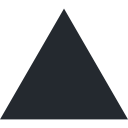
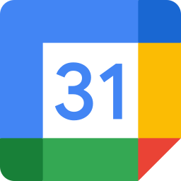
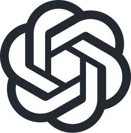
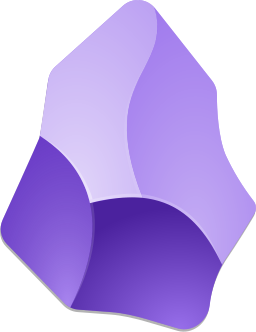

  

###

  
  
  <picture><source media="(prefers-color-scheme: dark)" srcset="logos/nextjs.svg" /></picture>
  
  
  
  
  
  
  
  
  
  
  
  
  
  
  
  
  
  
  
  
  
  
  
  
  
  
  
  <picture><source media="(prefers-color-scheme: dark)" srcset="logos/aws.svg" /></picture>
  
  <picture><source media="(prefers-color-scheme: dark)" srcset="logos/vercel.svg" /></picture>
  
  
  
  <picture><source media="(prefers-color-scheme: dark)" srcset="logos/github.svg" /></picture>
  
  
  
  
  
  
  
  <picture><source media="(prefers-color-scheme: dark)" srcset="logos/instagram.svg" /></picture>
  
  
  
  
  
  
  
  <picture><source media="(prefers-color-scheme: dark)" srcset="logos/codex.svg" /></picture>
  
  
  
  
  
  
  
  
  
  
  

###

  
  
  

###

  

###
